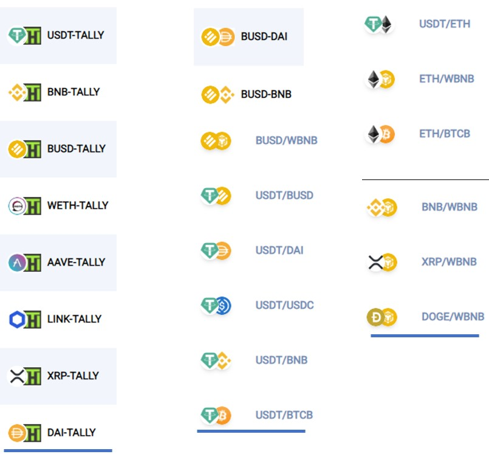

# 💰 Add Liquidity (Airdrop Campaign)

## Become a Liquidity Provider with Tally Exchange and Win a TallyNFT

<mark style="color:purple;">Be one of the first to Add Liquidity and be the first to earn high returns</mark>

## <mark style="color:green;background-color:yellow;">**1,000 TallyNFT GIVEAWAY!**</mark>

#### Welcome to Tally Exchange for trading cryptocurrency – The SWAP platform with a difference

What do you get for adding liquidity and supporting Tally Exchange?

* You will receive 0.17% portion of transaction fees from TallySWAP
* You will be entered into a draw each month to Win a TallyNFT when the NFT Marketplace launches.

## What separates Tally Exchange from other SWAPS

#### Firstly, Tally Exchange is a DEX

Decentralised Exchange. No KYC needed to trade on this platform.\
Community run. Peer to Peer platform with tokens and liquidity is provided by you.

<mark style="color:purple;">**Unique Features**</mark>

Other than the standard features expected from any DEX, there are innovative products/services hosted on the platform provided by partnerships. Many of the products are aimed at users from all backgrounds attracting people who are not necessarily crypto orientated.

### <mark style="color:green;">Tally Pay DeFi</mark>

**Hosted on Tally Exchange**

**Tally Pay DeFi** is a online storage facility similar to a bank but fully decentralised, where users deposit funds. [Discover Tally Pay DeFi](https://app.tally.ho.org/tally-pay)\
<mark style="color:green;">**Organic Traffic**</mark>\
Account holders visit Tally Exchange to access their accounts.\
TallySWAP is the most convenient place for Account holders to trade. Why?

They are already on the platform.  They are either depositing their tokens or making withdrawals.  Tally Token is a utility token used by Tally Pay DeFi.  TallySWAP is the first place they visit to purchase Tally Tokens.  Tally Tokens is a favourable choice as a liquidity pair.

* When you provide your tokens, you receive a receipt for your tokens. The receipt allows you to remove your tokens from the Tally Exchange at any time.
* You can earn a portion of trading fees as a passive income. _Tokens sitting in your crypto wallet earns nothing._
* They are already on this platform for the purpose to deposit and withdraw their crypto funds
* Tally Pay DeFi offers incentives encouraging their account holders to use TallySWAP
* Account Holders are aware of the TallyBACK reward for trading on TallySWAP

_If you are the provider of the token they require, you earn 0.17% of transaction fee._

### Tally<mark style="color:green;">BACK</mark>

With other Exchanges. a transaction fee is charged for each trade. This is normal practice and a requirement in order to sustain the platform and activities.\
On TallySWAP, traders are rewarded with Tally Tokens each time they make a purchase. This reward is called TallyBACK. It works similar to credit card rewards.

#### <mark style="color:orange;">It's a no</mark>**-**<mark style="color:orange;">brainer where best to trade.</mark>

_If you are the provider of the token they require, you earn 0.17% of transaction fee_

## Target

Tally Exchange aims to be a platform where users expect to <mark style="color:orange;">find</mark> the token they require.\
\
In order to achieve this target, communities are needed to store their tokens on the Exchange. All tokens are welcome, the more the better.

* When you provide your tokens, you receive a receipt for your tokens. The receipt allows you to remove your tokens from the Tally Exchange at any time.
* You can earn a portion of trading fees as a passive income. _Tokens sitting in your crypto wallet earns nothing._

#### How much liquidity should you provide?

Before TallySWAP opens, we are looking for people to show support by being the first to provide the liquidity needed to operate. As a reward for early adopters, all providers will be entered into the TallyNFT Prize Draw on top of the earning potential as a Liquidity Provider.\
\
There is no minimum. Many small deposits together add up to big deposit.  With community peer-to peer collaboration, we can compete with the big institutions.\
Big deposits will earn you bigger potential by receiving a bigger portion of the pie.

#### What Initial Liquidity is needed?

All coins and tokens are required and welcome. However, the tokens below are most popular trading pairs and most wanted.

_To discover how adding pairs work, read doc on :_ [<mark style="color:orange;">How To Add Liquidity</mark>](https://docs.tally-ho.org/how-to-add-liquidity)<mark style="color:orange;"></mark>

### Interested in Entering the TallyNFT Prize Draw

[Complete the form](https://forms.gle/YazaMAaeAEWrdBt5A) to indicate that you are willing to provide liquidity\
\
TallySWAP will open when 10,000 Liquidity Provider target is reached.
