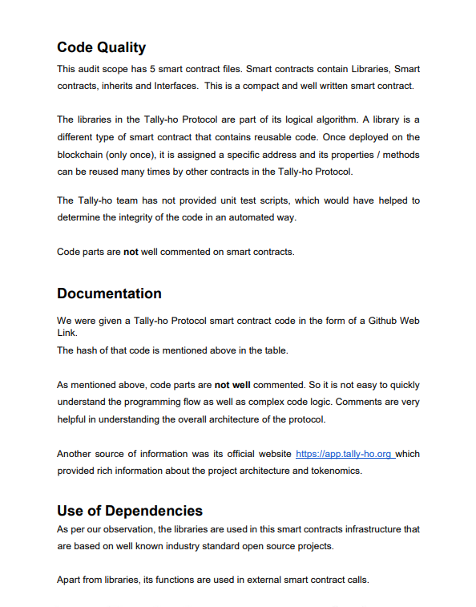

# 📋 Audit✅

.png>)

.png>)

 (1).png>)

.png>)

.png>)

.png>)

.png>)

.png>)

.png>)

.png>)

.png>)

 (1).png>)

.png>)

.png>)

.png>)

.png>)

.png>)

.png>)

 (1).png>)

.png>)

.png>)

.png>)

.png>)

 (1).png>)

.png>)

.png>)

.png>)

 (1).png>)

 (1).png>)

.png>)

 (1).png>)

.png>)

 (1).png>)

### &#x20;                                                             Audit Passed

### &#x20;                                                 .gif>)&#x20;

#### <mark style="color:blue;">Find sharper diagram images below</mark>

.png>)

 (1).png>)

.png>)

 (1).png>)
